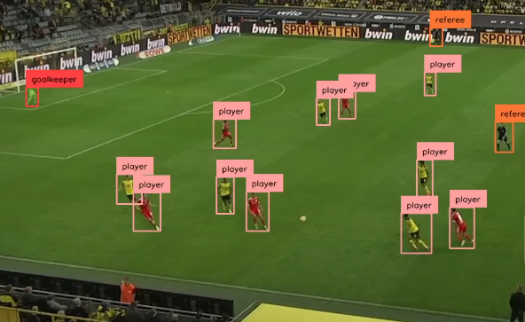
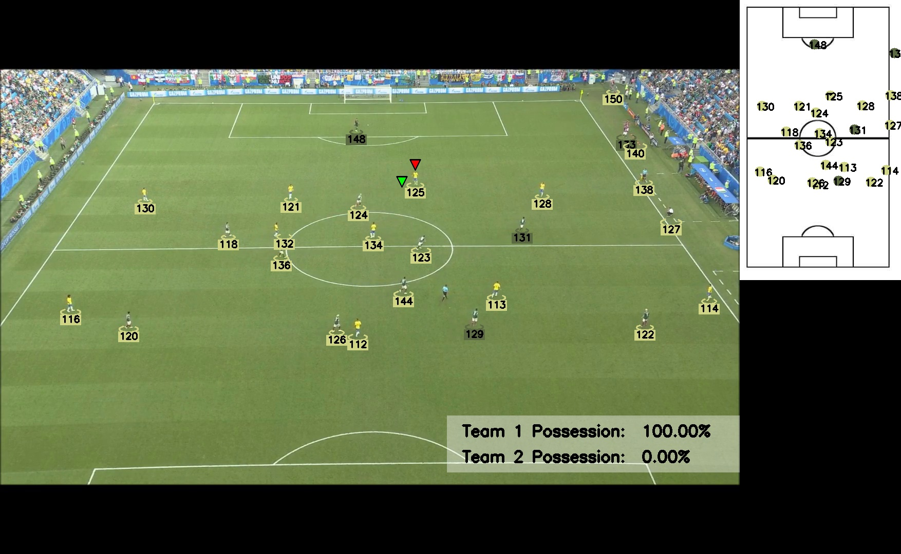

# Football Match Analysis Using Deep Learning and Computer Vision

## Introduction

The football analytics industry is rapidly growing, with professional teams increasingly relying on data-driven tools to analyze matches, training sessions, and player performance. However, these systems are often expensive and require specialized hardware for data collection, such as wearable devices or advanced camera setups.

This project proposes a cost-effective solution using **deep learning** and **computer vision** to automatically extract match statistics from single-camera video recordings. By leveraging advanced object detection models like YOLO and techniques such as homography, the system eliminates the need for additional sensors while providing a detailed tactical analysis. This approach is scalable and adaptable for a wide range of applications, from professional teams to amateur setups.

## Table of Contents

1. [Features](#features)  
2. [Installation](#installation)  
3. [Usage Instructions](#usage-instructions)  
4. [Data and Tools](#data-and-tools)  
5. [Methodology](#methodology)  
6. [Experiments and Results](#experiments-and-results)  
7. [Challenges and Limitations](#challenges-and-limitations)  
8. [Future Work](#future-work)  
9. [Contributors](#contributors)  
10. [License](#license)  

## Features

- **Object Detection**:
  - Detects players, referees, and the ball in video frames using YOLO.
- **Field Mapping (Homography)**:
  - Maps camera coordinates to a tactical view of the football field.
- **Tracking**:
  - Tracks individual players and the ball throughout the match using ByteTrack.
- **Team Classification**:
  - Identifies team affiliations using K-means clustering on jersey colors.
- **Key Metrics**:
  - Possession percentages for each team.
  - Distance covered by players.
  - Maximum and average player velocities.
  - Field zones most utilized during play.

## Installation

1. Clone the repository:
   ```bash
   git clone https://github.com/username/football-analysis.git
   cd football-analysis
   ```
2. Install the required dependencies:
   ```bash
   pip install -r requirements.txt
   ```

## Usage Instructions

To use this repository, please follow the instructions below to download and place the required model files.

### Download the Models

You need to download the models from the following link:

[Download Models](https://drive.google.com/drive/folders/12lZy15Re2JWODffdOS3dXjHso7QMiAvC?usp=sharing)

### Placement of Model Files

1. **For playing with the models and fine-tuning:**
   - Place the `yolov5xu.pt`, `yolov5x.pt`, and `yolov8x.pt` files in the `training` folder.

2. **To try the pre-trained model:**
   - Replace the entire `models` folder in this repository with the `models` folder from the download link.

### Summary

- Download the models from the provided link.
- Place the required `.pt` files in the `training` folder for fine-tuning.
- Replace the `models` folder to use the pre-trained model.

## Data and Tools

### Data Sources
- **Football Players Detection Dataset**: Used for player, referee, and ball detection.
- **Custom Annotated Dataset**: Created to train YOLOv8 for detecting field keypoints.

### Libraries and Frameworks
- **Object Detection**: YOLOv5 and YOLOv8 by Ultralytics.  
- **Tracking**: ByteTrack for multi-object tracking.  
- **Analysis Tools**: NumPy, OpenCV, and PyTorch.

## Methodology

<p align="center">
 

1. **Object Detection**:
   - **YOLOv5** is used to detect players, referees, and the ball.
   - **YOLOv8** is fine-tuned to identify key field points such as lines, circles, and goals for homography.

2. **Field Homography**:
   - A homography matrix is calculated to transform detected objects’ coordinates into a tactical field perspective. This enables spatial analysis of player positions and ball movements.

3. **Tracking**:
   - **ByteTrack** assigns unique identifiers to players and the ball across frames, ensuring continuity in tracking even when objects briefly leave the frame.

4. **Team Classification**:
   - Colors extracted from detected players’ bounding boxes are clustered using K-means to classify team affiliations.

5. **Metric Computation**:
   - Distances, velocities, and possession statistics are calculated using player trajectories mapped to the homography-transformed field.

## Experiments and Results

1. **Detection Performance**:
   - YOLOv5 effectively detected players and referees with high precision but struggled with smaller objects like the ball due to dataset limitations.

<p align="center">
  

   - YOLOv8 achieved good results in the less chaotic videos for field keypoint detection but struggled greatly with the fast camera movements.
<p align="center">
  
</p>

<p align="center"><em>Steady scenario where the model performed exceptionally well at detecting keypoints.</em></p>

  - Using these points, we attempted to organize and predict their exact coordinates. However, this effort was unsuccessful due to insufficient information about their relative positions. To address this, we decided to use fixed top-down perspectives of the field, providing a consistent reference for arranging the points systematically
    
2. **Tracking and Classification**:
   - ByteTrack maintained robust tracking even during occlusions.
   - K-means successfully classified players into teams based on jersey colours.

3. **Generated Metrics**:
   - Distances covered, velocities, and possession statistics were calculated for individual players and teams. These metrics were validated against manual annotations.

4. **Challenges**:
   - Frequent camera perspective changes posed significant challenges for maintaining consistent homography.
   - Limited ball detection accuracy impacted possession metrics.

5. **Results**:
  - The final result is presented using footage from the training camera instead of the broadcast television feed. This decision was made because the rapid camera movements in the televised footage prevented accurate homography calculations.
<p align="center">
  
</p>

<p align="center"><em>Detection and mapping of players' positions on the field, with calculated team possession percentages.</em></p>


## Challenges and Limitations

- **Ball Detection**: Small object size and motion blur reduced detection accuracy.  
- **Homography**: Camera angle variability required manual adjustments in some cases.  
- **Limited Dataset**: The dataset lacked sufficient diversity for generalization to all match scenarios.

## Future Work

1. **Improved Ball Detection**:
   - Use a larger and more diverse dataset to enhance YOLO’s performance on small, fast-moving objects.

2. **Automated Homography**:
   - Train models specialized in pose estimation to provide more robust and automated field mapping.
<p align="center">

</p>

<p align="center"><em>Key points for pose estimation.</em></p>

3. **Expanded Metrics**:
   - Include tactical insights such as formations, pass networks, and heatmaps.

4. **Real-Time Processing**:
   - Optimize the pipeline to enable real-time analysis during live matches.

## Contributors

- **Marc Serra Ortega**  
- **Pol Pugibet Martínez**

## License

This project is licensed under the [MIT License](LICENSE).
